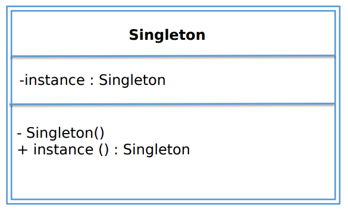
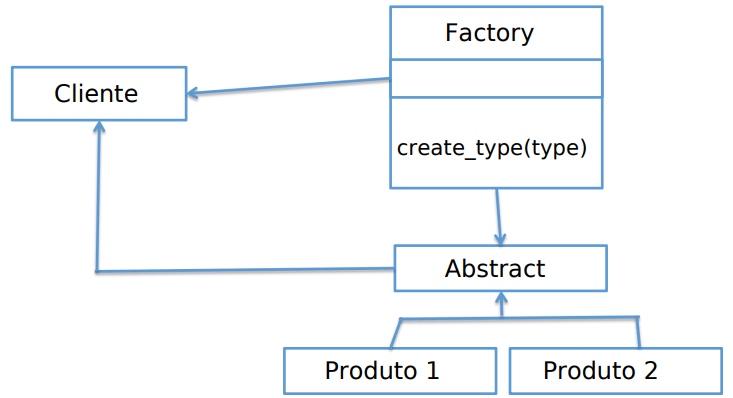
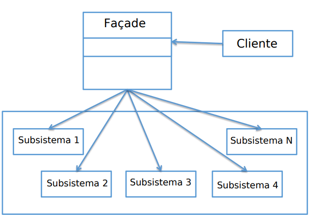
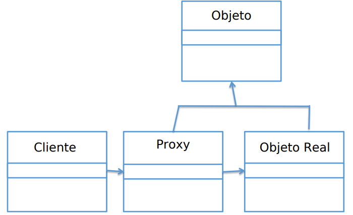
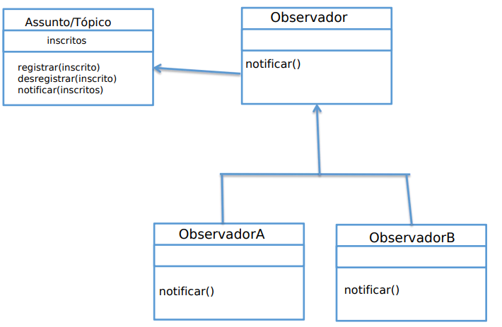

# Design Patterns in Python

## Referencies

[Course](https://itau.udemy.com/course/padroes-de-projeto-com-python/learn/lecture/20741470#content)

 

## Patterns

 

### Creation

 

#### Singleton

- [Generic Folder](./secao03/)
- [Padrão](./secao03/padrao/)
- [Lazy instance](./secao03/lazy/)
- [Módulos](./secao03/modulo/)
- [Monostate](./secao03/monostate/)
- [Metaclasse](./secao03/metaclasse/)
- [Projetos](./secao03/projetos/)

#### Factory

- [Generic Folder](./secao04/)
- [Simple](./secao04/simple/)
- [Factory Method](./secao04/method/): criar um produto
- [Abstract Factory](./secao04/abstract/): criar uma família de produtos relacionados

 

### Structural 

 

#### Facade

- [Generic Folder](./secao05/)
- [Padrão](./secao05/padrao/)

#### Proxy

- [Generic Folder](./secao06/)
- [Proxy](./secao06/proxy/)
- [Proxy2](./secao06/proxy2/)

 

### Behavioral

 

#### Observer

